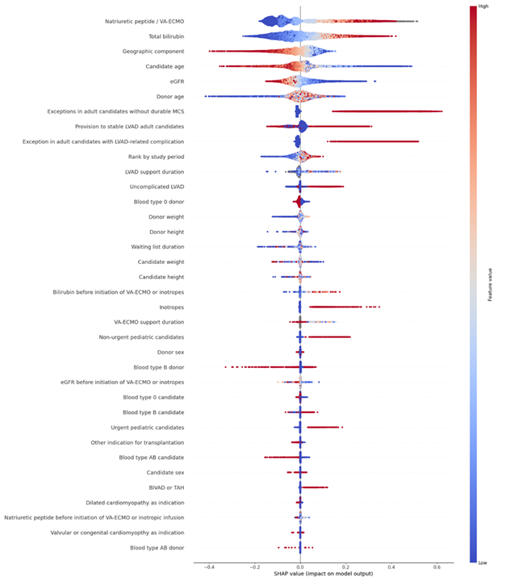

# Heart Transplantation and Machine Learning in France

Source code for the research work initiated and published by the French Agence de la Biomedecine on heart transplantation. This repository contains data processing, exploratory analysis, and machine learning workflows to analyze and explain the rank order of candidates for heart transplantation in France.

Article entitled : **"Rank Order of Candidates for Heart Transplantation in France: An Explainable Machine Learning analysis"**

## Table of Contents

- [Project Overview](#project-overview)
- [Repository Structure](#repository-structure)
- [Data Preparation](#data-preparation)
- [Exploratory Data Analysis (EDA)](#exploratory-data-analysis-eda)
- [Machine Learning Workflow](#machine-learning-workflow)
- [Model Benchmarking](#model-benchmarking)
- [Explainability & Visualization](#explainability--visualization)
- [Requirements](#requirements)
- [Usage](#usage)
- [License](#license)

---

## Project Overview

This project aims to build explainable machine learning models to understand and predict the rank order of candidates for heart transplantation in France. It includes:

- Data cleaning and preprocessing
- Exploratory data analysis (EDA)
- Feature engineering and selection
- Training and evaluation of regression models (Decision Tree, Random Forest, XGBoost, etc.)
- Model benchmarking
- Explainability using SHAP, LIME, and other visualization techniques



## Repository Structure

```
.gitignore
LICENSE
README.md
data/
    fictitious_data.pkl
results/
sources/
    1_Data_Explorer_ABM_final.ipynb
    2_MachineLearning_ABM_final.ipynb
    analyses.py
    benchmark_ml_ABM.py
    ml_data_viz_ABM.py
    ml_training_ABM.py
    params_ABM.py
```

- **data/**: Contains input data files (e.g., pickled DataFrames).
- **results/**: Stores output files, figures, and reports.
- **sources/**: All source code and Jupyter notebooks.

## Data Preparation

- Data is imported and preprocessed in [sources/1_Data_Explorer_ABM_final.ipynb](sources/1_Data_Explorer_ABM_final.ipynb).
- Preprocessing includes cleaning, encoding categorical variables, handling missing values, feature engineering (e.g., glomerular filtration rate), and exporting a cleaned dataset for ML.

## Exploratory Data Analysis (EDA)

- EDA is performed using pandas profiling and custom analysis functions in [`analyses.correlation_pearson`](sources/analyses.py), [`analyses.correlation_spearman`](sources/analyses.py), [`analyses.plot_delai`](sources/analyses.py), and [`analyses.plot_rank`](sources/analyses.py).
- Visualizations and statistical summaries help understand feature distributions and correlations.

## Machine Learning Workflow

- The main ML workflow is in [sources/2_MachineLearning_ABM_final.ipynb](sources/2_MachineLearning_ABM_final.ipynb).
- Models are trained to predict the rescaled rank (`Rang_rescaled`) using features selected from the cleaned dataset.
- Group-aware cross-validation is used to avoid data leakage (stratification by donor).

### Key Scripts

- [`ml_training_ABM.train_cv_regressor`](sources/ml_training_ABM.py): Standard cross-validation training.
- [`ml_training_ABM.train_cv_regressor_group_effect`](sources/ml_training_ABM.py): Group-aware cross-validation for repeated measures.

## Model Benchmarking

- Multiple regression models are benchmarked in [`benchmark_ml_ABM.run_benchmark`](sources/benchmark_ml_ABM.py) and [`benchmark_ml_ABM.show_results_bench`](sources/benchmark_ml_ABM.py).
- Models include Linear Regression, Ridge, Lasso, Decision Tree, Random Forest, MLPRegressor, and XGBoost.
- Results are visualized and compared using MSE and R² metrics.

## Explainability & Visualization

- Model explainability is provided via SHAP, LIME, and custom visualizations in [`ml_data_viz_ABM.py`](sources/ml_data_viz_ABM.py).
- Functions include:
  - [`ml_data_viz_ABM.train_vs_test_error_curve`](sources/ml_data_viz_ABM.py)
  - [`ml_data_viz_ABM.residual_plot`](sources/ml_data_viz_ABM.py)
  - [`ml_data_viz_ABM.feature_importance`](sources/ml_data_viz_ABM.py)
  - [`ml_data_viz_ABM.partial_dependence_plot`](sources/ml_data_viz_ABM.py)
  - [`ml_data_viz_ABM.compute_shap_values`](sources/ml_data_viz_ABM.py)
  - [`ml_data_viz_ABM.draw_single_shap_plot`](sources/ml_data_viz_ABM.py)
  - [`ml_data_viz_ABM.draw_single_shap_plot_uni`](sources/ml_data_viz_ABM.py)

## Requirements

- Python 3.12
- Main libraries: pandas, numpy, scikit-learn, xgboost, matplotlib, seaborn, tqdm, shap, lime, alibi, plotly, ydata_profiling, IPython

Install dependencies using:

```sh
pip install -r requirements.txt
```

*(Create `requirements.txt` based on imports in the source files.)*

## Usage

1. **Data Preparation & EDA**  
   Run [sources/1_Data_Explorer_ABM_final.ipynb](sources/1_Data_Explorer_ABM_final.ipynb) to preprocess data and perform EDA.

2. **Machine Learning & Explainability**  
   Run [sources/2_MachineLearning_ABM_final.ipynb](sources/2_MachineLearning_ABM_final.ipynb) to train models, benchmark, and visualize results.

3. **Custom Analysis**  
   Use functions from [`analyses.py`](sources/analyses.py), [`ml_data_viz_ABM.py`](sources/ml_data_viz_ABM.py), and [`benchmark_ml_ABM.py`](sources/benchmark_ml_ABM.py) for further analysis and visualization.

## License

MIT License © 2025 French Agence de la Biomédecine. See [LICENSE](LICENSE) for details.

---

For questions or contributions, please contact the authors listed